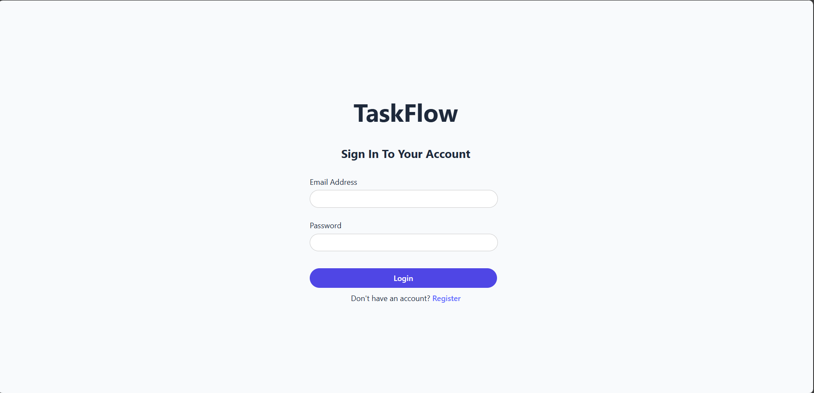

# 📝 TaskFlow – A Task Management App

TaskFlow is a full-stack task management application that lets users register, log in, and manage their personal tasks with a clean, modern UI. Built with React, Node.js, TypeScript, PostgreSQL, and Prisma — it’s designed to demonstrate clean architecture and practical CRUD operations.

---

## 🚀 Features

- ✅ **User Authentication** with JWT (Register & Login)
- ✅ **Protected Routes** using middleware
- ✅ **Add New Tasks** via modal form
- ✅ **Live Task Listing** on dashboard
- ✅ **Mark Tasks as Done** (delete functionality)
- ✅ **Responsive UI** with Sidebar and Task Cards
- ✅ **Toast Notifications** for feedback
- ✅ **Clean Folder Structure** (Controllers, Routes, Models, etc.)
- ✅ **PostgreSQL + Prisma** for robust database handling

---

## 🧱 Tech Stack

### Frontend
- React + TypeScript + Vite
- React Router
- React Toastify
- Axios

### Backend
- Node.js + Express
- TypeScript
- PostgreSQL + Prisma
- JWT (Authentication)
- CORS & Middleware

---

## 📸 Screenshots

| Login | Dashboard |
|-------|-----------|
|  |  |

---

